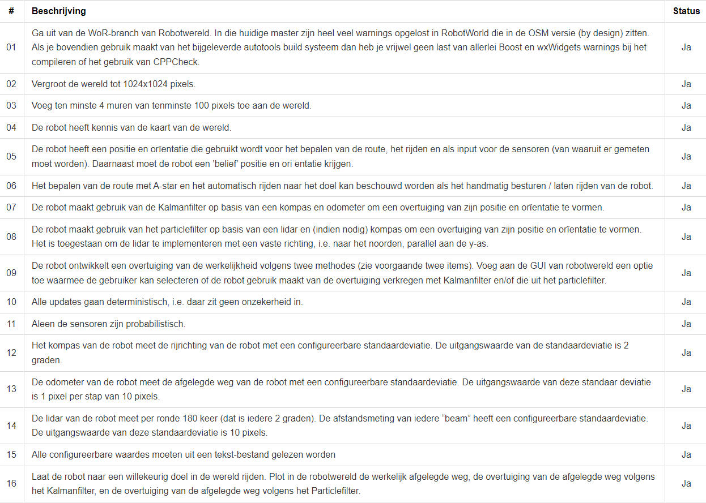

# Kinematica uitwerking - WoR Robots
Dit is een uitwerking van de kinematica opdracht van het vak WoR-Robots.

## 1. Compileren voor Linux
Indien wxWidgets en Boost zijn geïnstalleerd, is dit programma te compileren.
Hiervoor volgt u de volgende stappen:
1. Ga naar de root van dit project (root is de folder waar ook deze README.md is opgeslagen).
2. Voer het volgende commando uit:
    > chmod +x ./build_and_run.sh
4. Nu ben je in staat om alleen ./build_and_run.sh uit te voeren:
    > ./build_and_run.sh

## 2. Gerealiseerde features
### 2.1 Uitvoeren met een aangepast configuratiebestand
Om het programma uit te voeren met een aangepast configuratiebestand, gebruikt u de volgende commando's (uitgaande dat het programma al eerder is gecompileerd, zo niet, voer de drie stappen hierboven uit onder "Compileren voor Linux"):

1. Ga naar de root van dit project (root is de folder waar ook deze README.md is opgeslagen).
2. Voer het volgende commando uit:
    > ./build/kinematica -config="config_file.txt"

### 2.2 Opdracht progressie
